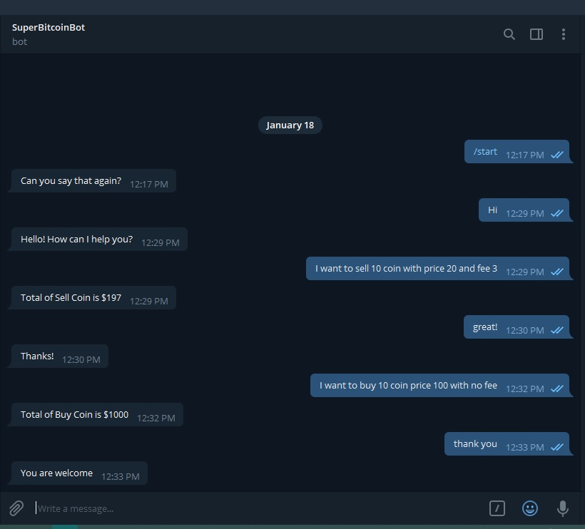

# Buy and Sell Coin Bot with Node.JS



This is a Bot based on Node.JS that pulled a request of intent from Dialogflow and paste the answer to Telegram.

You can try a conversation and make a request to Buy or Sell Bitcoin and Bot will answer how many you must pay.

> Format of Buy Command

- 10 coin price 10 fees 10 buy
- buy 10 price 10 fee 10
- buy coin 10 price 10 fees 10
- I want to buy coin 10 with price 10 and fees 10


> Format of Sell Command

- 10 coin price 10 fees 10 sell
- sell 10 price 10 fee 10
- sell coin 10 price 10 fees 10
- I want to sell coin 10 with price 10 and fees 10

<<<<<<< HEAD

=======
>>>>>>> 6df177af4321fbf22b800b75a6a1681e9081c022
Telegram bot name : [SuperBitcoinBot](t.me/amazing_coin_bot)

Running Locally in your machine :

```
git clone

yarn install

nodemon index.js
```
